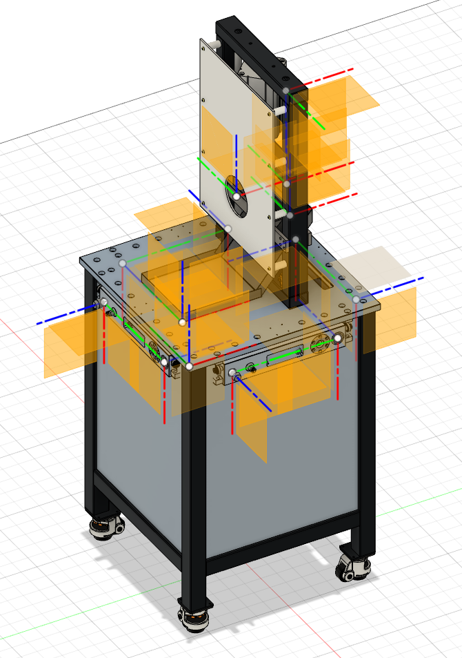

# urdf_creator

# Conversion of CAD data in STEP format to URDF format #

The main objective of our work is to realize a versatile and automated conversion of CAD models to URDF format. The automation must be suitable for most CAD programs used for geometric data generation and it must not significantly limit the designer by the required CAD model tree structure. In order to be able to use any CAD software for generating or modifying geometric data, we have chosen the Standard for the Exchange of Product Data (STEP) format as the input format for our automation process. STEP format is widely used and is supported by all CAD programs. It can represent 3D objects and the related information. Due to its ASCII structure, it is human readable. In our development process, we used the Fusion 360 CAD program for STEP file creation, but any of the standard CAD programs could be used instead.

We developed ROS Python packages to automate the transformation from the STEP format into the URDF format. The program takes as input the STEP file of the desired hardware element and creates a new ROS package. The package created contains the URDF description, the STL mesh files required by URDF description, and the ROS launch file to load the data into the ROS control system. The URDF file is generated in the following steps. First, the STEP file is loaded and its contents are analyzed using tools from the Open Cascade Technology (OCCT) library. The analysis looks for keywords such as "joint" and "link" in the part names or in the assembly names in the model design tree. The instances with these keywords in their names represent the corresponding "joint" and "link" building blocks of URDF.  The remaining part names containing the keyword encode the connections between individual URDF elements and their names in the URDF file. Once these instances and their connections have been identified, the correct local transformation between them must be computed from the values of their base coordinate systems in the STEP file. The calculated local transformations are transformed accordingly into the coordinate system values of the "joint" and "link" URDF definitions. The instances that do not have keywords in their names represent geometric shapes. They are transformed into the STL mesh specified in the appropriate local coordinate system according to the given URDF tree structure. From the collected and computed URDF data, the XML in URDF format is created using the urdfdom parser library. Finally, everything is stored in a newly created ROS package.

To be able to use a STEP file for URDF generation, the model must be prepared in the CAD system with the required joint and link definitions. This is done by adding parts representing joints and links (Figure 1B) to the initial CAD model (Figure 1A). To define the joints, we create a subassembly with the keyword "joint" in the first place in its name. The following keyword describes which links the joint is connecting. For example, the subassembly named "joint\_base\_tool1" defines the joint that connects the "base" link to the "tool1" link. The type of joint is defined by the name of the part in the assembly (fixed, rotating, etc.). This part must be added to a geometric shape because empty parts are ignored by CAD systems when exporting data in STEP format. The shape of these parts can be arbitrary as our transformation script ignores them later.
% We used a solid sphere at the center of the part's coordinate system.
To define the geometric shapes corresponding to a link, a subassembly must be defined with the first keyword "link" followed by the corresponding name of the link. This subassembly must be located in the CAD design tree structure hierarchy above all parts and subassemblies that need to be included in the specific link. The parts and subassemblies for which no link is defined above them in the hierarchy are added to the "base" link of the URDF.

*The geometric shape model of the archetypical module is designed in the CAD system (a). The parts representing the desired link and joint coordinate systems can then be added in the CAD model design tree (b).*

Since the joint and link definitions are connected in the original CAD model, any change to the original shape data automatically changes the positions of the joint and link definitions. When the modified CAD model is exported to STEP and converted to URDF, all changes are automatically imported to ROS, as shown in Figure 2. This figure also demonstrates the practical use of links with fixed joints. For example, we have defined characteristic points in the CAD model such as centering pins and holes of the Plug \& Produce connectors and center points of the four tool holders (Figures 2A and 2B). After transformation to URDF, the associated coordinate frames are directly available to the ROS system (see Figures 2C and 2D). This allows different modules to be connected to each other by aligning adjacent modules using pins and holes links. Furthermore, this allows the ROS nodes to easily read the transformations between the links of different modules. For example, the position of the tool holder in the robot coordinate system is automatically available once the tool storage module is connected to the robot module by aligning the connector link. Similarly, for the cutting module in Figure 3, in addition to the characteristic connector points, we have defined characteristic points that are important to the robotic cutting process. Points such as the center of the blade, the two cutting edges of the blade, and the beginning of the tray coordinate system are defined. The cutting module example also demonstrates the definition of a movable joint. The prismatic joint defined in the Figure 3 is shown in motion in Figure 4. In the CAD model, we defined the prismatic joint initial position, the direction of motion and the group of geometric shapes moving with the joint. Accordingly, the shape defined in URDF changes when the value of the corresponding joint in the ROS workcell control system is changed. 

*The initial CAD model of the robot platform (a) has been automatically converted to the corresponding URDF model (c).  When the robot platform design changes from (a) to (b), the links and joints coordinate systems change at the same time, since they are mated to the the CAD geometry. After the change, the CAD model is exported again to a new STEP file. When our script is run with the new STEP file, it immediately generates the new URDF describing the changed platform (d).*

*Conversion of the CAD model including the attached coordinate systems (a) into the URDF format that can be visualized in RViz, shown in (b) and (c).*

*Geometric shapes are grouped in the links, which allows the shapes to follow the motion defined by the joint values. In the above images, the cutter head moves according to the prismatic joint value defined by the slider.*

In the current stage of development, our system is able to transform geometric shapes defined as solids or meshes in CAD software to URDF format. Also, the colors of these shapes are taken from the CAD model and preserved in the URDF definition. The program also detects the definition of fixed, revolute and prismatic joints including the initial position and direction of motion. 

In our future work, we will continue to improve the versatility of the required CAD model tree structure by extending the definition of joints and links to all levels within the hierarchy. We will optimize the definition of the keyword convention and add options to define the range of joint motion. The space required to store the generated STL shapes can be reduced by grouping all shapes that do not have relative motion to each other into one mesh. Finally, in the operational phase of the cell, all coordinate frames defined in the cell might have significant errors due to inaccuracies in the manufacturing of the modules. In this case, proper coordinate frames must be calibrated on the actual module. We will prepare a mechanism to allow the URDF data to be modified using the results of the calibration process.
